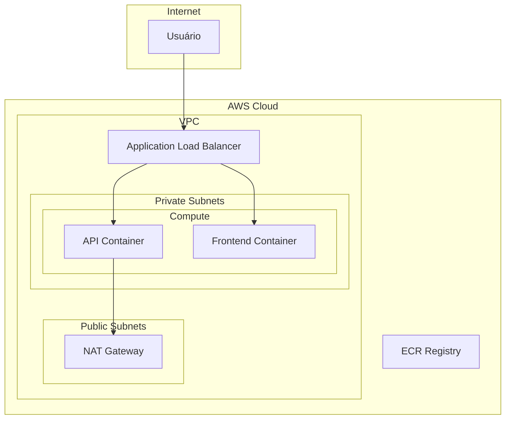

# Arquitetura da Solução

> **NOTA**: Este é um template. O candidato deve preencher com a arquitetura implementada.

## Visão Geral

_Descreva aqui a visão geral da arquitetura implementada._

## Diagrama de Arquitetura

_Inclua um diagrama da arquitetura. Pode usar:_
- [Draw.io](https://draw.io)
- [Excalidraw](https://excalidraw.com)
- [Mermaid](https://mermaid.js.org/)
- ASCII Art

### Exemplo com Mermaid:



## Componentes

### Rede (VPC)

| Componente | Descrição | CIDR |
|------------|-----------|------|
| VPC | _Descrição_ | _10.0.0.0/16_ |
| Public Subnet 1 | _Descrição_ | _10.0.1.0/24_ |
| Public Subnet 2 | _Descrição_ | _10.0.2.0/24_ |
| Private Subnet 1 | _Descrição_ | _10.0.10.0/24_ |
| Private Subnet 2 | _Descrição_ | _10.0.11.0/24_ |

### Compute

_Descreva a solução de compute escolhida (EKS, ECS, EC2)._

| Aspecto | Decisão | Justificativa |
|---------|---------|---------------|
| Plataforma | _EKS/ECS/EC2_ | _Por que escolheu?_ |
| Tipo de instância | _t3.medium_ | _Por que?_ |
| Auto Scaling | _Sim/Não_ | _Configuração_ |

### Segurança

_Descreva as medidas de segurança implementadas._

- **Security Groups**: _Descrição_
- **IAM Roles**: _Descrição_
- **Secrets Management**: _Descrição_
- **Network ACLs**: _Descrição_

## Fluxo de Deploy

```
1. Developer faz push → GitHub
2. GitHub Actions dispara pipeline
3. Build e testes executados
4. Imagem Docker criada
5. Scan de vulnerabilidades
6. Push para ECR
7. Deploy para staging (automático)
8. Testes de integração
9. Aprovação manual
10. Deploy para produção
```

## Estimativa de Custos

_Use o [AWS Pricing Calculator](https://calculator.aws/) para estimar custos._

| Serviço | Especificação | Custo Mensal Estimado |
|---------|---------------|----------------------|
| EC2/EKS/ECS | _Spec_ | _$XX.XX_ |
| ALB | _Spec_ | _$XX.XX_ |
| NAT Gateway | _Spec_ | _$XX.XX_ |
| ECR | _Spec_ | _$XX.XX_ |
| **Total** | | **$XX.XX** |

## Escalabilidade

_Descreva como a arquitetura escala._

### Horizontal

- _Como novos containers/instâncias são adicionados?_
- _Quais métricas disparam o scaling?_

### Vertical

- _A aplicação suporta upgrade de recursos?_

## Alta Disponibilidade

_Descreva como a alta disponibilidade é garantida._

- Multi-AZ: _Sim/Não_
- Réplicas: _Quantidade_
- Health Checks: _Configuração_

## Disaster Recovery

| Métrica | Objetivo | Implementação |
|---------|----------|---------------|
| RPO (Recovery Point Objective) | _X horas_ | _Como?_ |
| RTO (Recovery Time Objective) | _X minutos_ | _Como?_ |

## Observabilidade

_Descreva a stack de observabilidade._

### Logs
- _Onde os logs são centralizados?_
- _Como são acessados?_

### Métricas
- _Quais métricas são coletadas?_
- _Onde são visualizadas?_

### Alertas
- _Quais alertas estão configurados?_
- _Como são notificados?_

## Limitações Conhecidas

_Liste limitações da arquitetura atual e possíveis melhorias futuras._

1. _Limitação 1_ → _Melhoria sugerida_
2. _Limitação 2_ → _Melhoria sugerida_

## Referências

- [AWS Well-Architected Framework](https://aws.amazon.com/architecture/well-architected/)
- [Terraform AWS Modules](https://registry.terraform.io/namespaces/terraform-aws-modules)
- _Outras referências utilizadas_
